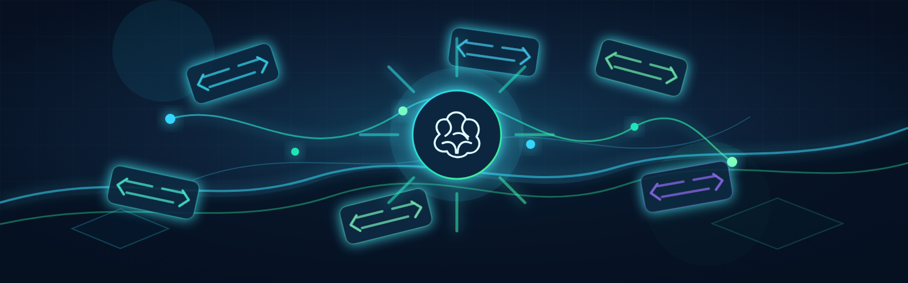

<p align="center">
  
</p>

<h1 align="center">DataOcean</h1>

<p align="center">
  <strong>面向企业数据团队的治理型 NL2SQL 智能查询平台</strong><br/>
  让业务人员用自然语言查询数据，同时保留元数据治理、权限边界、SQL 安全沙箱和结果可追溯性。
</p>

<p align="center">
  
  
  
  
  
  
</p>

---

## 项目简介

DataOcean 是一个企业级 NL2SQL 智能数据查询与治理平台。用户在查询端选择一个 MySQL 数据源后，可以直接用中文提问；系统会基于已发布的元数据快照和 `skills.md` 业务知识召回相关上下文，生成 SQL，通过安全沙箱校验和只读执行后返回表格、图表、SQL 与解释。

它不是单纯的 Text-to-SQL Demo。DataOcean 的核心原则是：

> AI 只能在可信元数据、明确权限和可审计执行链路内查询数据。

## 最新进度

最后更新：2026-06-06。

当前主链路已经跑通：

```text
Java 提交查询任务
  -> Python Agent
  -> Query Rewrite
  -> Schema RAG 召回
  -> SQL 生成
  -> sqlglot AST 校验与改写
  -> 只读沙箱执行
  -> Java 持久化与脱敏
  -> 前端表格/图表渲染
```

近期重点更新：

- RAG 分工已调整为：Java 负责文档生命周期、审核、版本、发布、任务状态和 chunk snapshot 持久化；Python 负责 chunking、embedding、Milvus 写入、检索和重排。
- Java 端旧的 `KnowledgeChunkSplitter` 已移除，Python `chunker.py` 成为切割策略唯一来源。
- skills.md 发布流程改为先生成新版本 chunk snapshot，再写入并验证 Milvus，确认成功后才切换为生效版本。
- 向量化失败时旧版本 RAG 保持可用，避免发布失败导致检索空窗。
- 新增 Flyway 迁移 `V35__rag_python_chunking_lifecycle.sql`，补充 chunk 生命周期状态和 `doc_id + version_no` 索引。
- 最新验证：Python 测试 24 个通过，Java 测试 40 个通过。

## 核心能力

| 能力 | 说明 |
| --- | --- |
| 自然语言查询 | 用户在 `/query` 选择数据源并直接提问，返回表格、图表、SQL、解释和建议问题。 |
| 元数据治理 | 支持元数据采集、质量检查、问题修复、审核发布、版本快照和生命周期管理。 |
| skills.md 知识库 | 基于治理后的元数据生成业务语义说明书，审核发布后进入 RAG。 |
| Schema RAG | 使用 Milvus 召回已发布的表、字段、Join Path、指标口径、字段防坑和查询场景。 |
| SQL 安全沙箱 | 基于 `sqlglot` 做 AST 校验、SELECT-only 限制、权限改写、LIMIT 注入、超时和取消。 |
| 权限与脱敏 | Java 统一处理数据源授权、敏感字段脱敏、审计记录和任务状态。 |
| 图表生成 | Python 生成 ECharts Option，前端统一渲染、切换和导出。 |
| 治理闭环 | 查询审计、字段可信度、用户反馈和血缘分析持续回流治理侧。 |

## 系统架构

<p align="center">
  
</p>

```text
Vue 3 前端
  - 查询端 /query
  - 治理后台 /admin/*
        |
        | HTTP API / SSE
        v
Spring Boot Java 网关
  - 鉴权、权限、数据源、元数据治理
  - skills.md 生命周期、审核、发布、审计、脱敏
        |
        | OpenFeign 内部调用
        v
Python FastAPI AI 服务
  - Query Rewrite、Schema RAG、SQL 生成
  - SQL 沙箱、图表生成、chunking、embedding、rerank
        |
        v
Milvus / MySQL / Redis / Qwen
```

技术栈：

| 层级 | 技术 |
| --- | --- |
| 前端 | Vue 3, Vite, TypeScript, Vue Router, Pinia, Element Plus, ECharts |
| Java 网关 | Spring Boot 3.x, JDK 17, Spring Security, JWT, MyBatis-Plus, Flyway, Redis, OpenFeign |
| Python AI 服务 | Python 3.13, FastAPI, LangGraph, LlamaIndex, SQLAlchemy, sqlglot, pymilvus |
| 基础设施 | MySQL 8, Redis, Milvus 2.x Standalone, Qwen/DashScope |
| 部署 | Docker Compose |

## RAG 发布流程

当前 RAG 策略强调“新版本验证成功后再切换”：

```text
APPROVED skills.md
  -> Java 标记 INDEXING 并创建向量任务
  -> Python /internal/rag/chunk 切割文档
  -> Java 将 chunk 清单作为新版本 snapshot 写入 MySQL
  -> Python embedding 并写入 Milvus
  -> Python 校验 Milvus 写入数量
  -> Java 在事务内标记 chunks INDEXED、文档 PUBLISHED、任务 COMPLETED
  -> Python 清理旧版本向量
```

关键约束：

- 切割由 Python 完成，不再由 Java 切割。
- Java 保存 Python 返回的 chunk snapshot，便于版本追踪、审计和任务状态管理。
- Milvus 写入和验证成功之前，不删除旧版本向量。
- 同版本重建时只清理当前 `doc_id + version_no`，避免误删正在生效的版本。

切割策略：

- 先按 `##` 章节识别 skills.md 的主要语义区块。
- 再按 `###` 三级标题细分，让每张表、每个指标、每对 Join Path、每条防坑指南或查询场景尽量形成独立 chunk。
- chunk 会带上 `chunk_type`、标题、顺序、内容摘要和版本信息，供检索、重排、审计和回滚使用。

## 快速开始

环境建议：

| 运行环境 | 版本 |
| --- | --- |
| JDK | 17 |
| Maven | 3.9+ |
| Node.js | 20+ |
| Python | 3.13 |
| uv | latest stable |
| Docker | Compose v2 |

启动基础设施：

```powershell
docker compose up -d
```

启动 Java 网关：

```powershell
cd backend\DataOcean
mvn spring-boot:run
```

启动 Python AI 服务：

```powershell
cd python-service
uv sync
uv run uvicorn dataocean.main:app --reload --port 8000
```

启动前端：

```powershell
cd frontend
npm install
npm run dev
```

默认入口：

- 前端：`http://127.0.0.1:5173`
- Java 网关：`http://127.0.0.1:8080`
- Python 服务：`http://127.0.0.1:8000`

## 测试

Python:

```powershell
cd python-service
uv run pytest
```

Java:

```powershell
cd backend\DataOcean
mvn test
```

最近一次完整验证：

- `python-service`: 24 passed.
- `backend/DataOcean`: 40 passed.

## 仓库结构

```text
DataOcean/
├── frontend/              Vue 3 前端项目
├── backend/DataOcean/     Spring Boot Java 网关
├── python-service/        FastAPI AI/RAG 服务
├── docs/                  架构设计和模块文档
├── specs/                 模块规格、计划、任务和接口契约
├── mock/                  已提交 mock 数据，不要修改或重新生成
├── output/playwright/     联调截图输出目录
└── docker-compose.yml     本地基础设施编排
```

## 文档导航

| 文档 | 内容 |
| --- | --- |
| [`CLAUDE.md`](CLAUDE.md) | 面向 AI 编码代理的项目工作指南 |
| [`docs/modules/006-knowledge.md`](docs/modules/006-knowledge.md) | skills.md 知识库和 RAG 生命周期设计 |
| [`docs/ai-config-design.md`](docs/ai-config-design.md) | AI 配置管理设计 |
| [`docs/nl2sql-单库多表版-项目构想.md`](docs/nl2sql-%E5%8D%95%E5%BA%93%E5%A4%9A%E8%A1%A8%E7%89%88-%E9%A1%B9%E7%9B%AE%E6%9E%84%E6%83%B3.md) | 项目整体构想 |
| [`specs/`](specs/) | 详细规格、数据模型、API 契约和任务清单 |

## 开发约定

- `mock/` 目录用于稳定联调数据，不要修改或重新生成。
- Java 负责管理态、生命周期、审核、版本、任务状态和脱敏。
- Python 负责 AI 执行态、RAG、chunking、embedding、Milvus、重排和 SQL 沙箱。
- 修改前端后，尽量用浏览器联调并把截图保存到 `output/playwright/`。
- 修改 RAG、发布、SQL 安全、权限或公共 API 时，需要补充或更新对应测试。

## License

MIT
