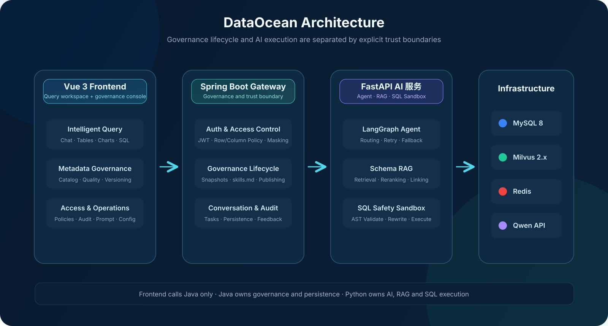
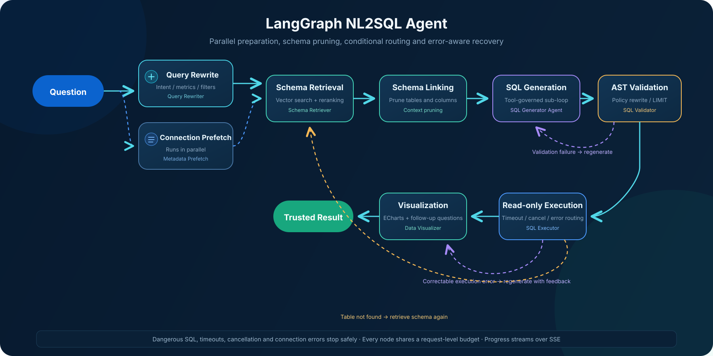
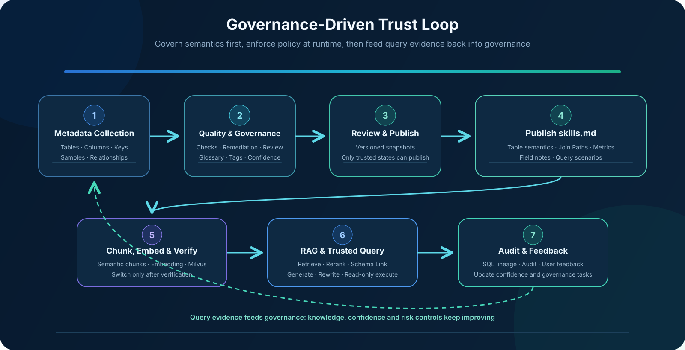

<p align="center">
  
</p>

<h1 align="center">DataOcean</h1>

<p align="center">
  <strong>元数据治理驱动的企业级 NL2SQL 智能查询平台</strong>
</p>

<p align="center">
  让业务人员用自然语言查询数据，同时把 Schema 语义、权限策略、SQL 安全与审计反馈纳入同一条可信执行链路。
</p>

<p align="center">
  <a href="#为什么是-dataocean">项目定位</a> ·
  <a href="#核心能力">核心能力</a> ·
  <a href="#系统架构">系统架构</a> ·
  <a href="#langgraph-agent-工作流">Agent 工作流</a> ·
  <a href="#快速开始">快速开始</a> ·
  <a href="#项目状态">项目状态</a>
</p>

<p align="center">
  
  
  
  
  
  
  
</p>

## 为什么是 DataOcean

很多 NL2SQL Demo 的链路是：把数据库 Schema 塞进 Prompt，让大模型直接生成 SQL。这个方案可以演示，但很难回答企业场景真正关心的问题：

- 模型看到的表、字段和指标口径是否经过治理？
- SQL 是否越过用户的数据权限，或包含危险函数和深层子查询？
- 执行失败后能否根据错误类型恢复，而不是机械地重复生成？
- 查询使用了哪些字段，结果如何审计，错误反馈怎样回流到治理侧？

DataOcean 的核心思路是：**AI 只能在可信元数据、明确权限和可审计执行链路内查询数据。**

| 普通 NL2SQL Demo | DataOcean |
| --- | --- |
| 一次 Prompt 直接生成 SQL | LangGraph 编排多节点工作流，并支持条件路由与恢复 |
| 依赖原始 DDL 或全量 Schema | 从已发布快照、`skills.md`、术语和可信度中召回上下文 |
| 依靠 Prompt 提醒模型“注意安全” | 使用 sqlglot AST 校验、权限改写和只读沙箱强制执行 |
| 生成失败即返回错误 | 校验失败、表不存在和可修复执行错误走不同恢复路径 |
| 查询与数据治理相互独立 | 血缘、审计和反馈持续回流到元数据治理闭环 |

> 当前范围：每次查询选择一个 MySQL 数据源，支持该数据库内的多表关联查询。

## 核心能力

| 能力 | 实现方式 |
| --- | --- |
| 自然语言问数 | 中文问题经过意图改写、Schema 召回、SQL 生成与执行，返回表格、图表、SQL 解释和追问建议。 |
| LangGraph Agent | 节点级时间预算、SSE 进度、条件路由、执行反馈自修复，并行执行 Query Rewrite 与连接预取。 |
| Schema RAG | 将表语义、Join Path、指标口径、字段说明和查询场景切分向量化，通过 Milvus 召回、重排和相邻上下文扩展。 |
| 元数据治理 | 覆盖采集、质量检查、问题修复、审核发布、版本快照、术语表、分类标签和字段可信度。 |
| SQL 安全沙箱 | 仅允许安全 `SELECT`，执行注入检测、危险函数拦截、表白名单、子查询深度限制、权限改写和强制 `LIMIT`。 |
| 权限与脱敏 | Java 管理数据源与行列级授权，Python 在 AST 层执行约束，Java 对查询结果完成最终脱敏。 |
| 可追溯查询 | 持久化会话、任务状态、Prompt 版本、查询审计、SQL 血缘和用户反馈。 |
| 可靠发布 | 新知识版本完成切分、向量写入和数量验证后才切换；失败时保留旧版本可用。 |

## 系统架构

<p align="center">
  
</p>

DataOcean 将业务治理与 AI 执行明确分层：

- **Vue 3 前端**：智能问数工作台，以及数据接入、资产、治理、语义、权限和运营后台。
- **Spring Boot 网关**：负责认证、权限、数据源、元数据、知识发布、会话持久化、审计和结果脱敏。
- **FastAPI AI 服务**：负责 LangGraph Agent、Schema RAG、SQL 生成、AST 校验、只读执行和图表生成。
- **基础设施**：MySQL 保存业务与治理数据，Milvus 保存知识向量，Redis 承担缓存与运行时状态，Qwen 提供模型与 Embedding 能力。

关键边界：**前端只调用 Java；Java 管理治理状态与持久化；Python 专注 AI、RAG 和 SQL 执行。**

## LangGraph Agent 工作流

<p align="center">
  
</p>

工作流不是固定的单向流水线：

1. `Query Rewriter` 提取指标、维度、过滤条件和时间范围；数据源连接信息同步预取。
2. `Schema Retriever` 从已发布知识中检索候选上下文，`Schema Linker` 进一步裁剪无关表和字段。
3. `SQL Generator` 通过受控工具调用子循环生成结构化 SQL 与解释。
4. `SQL Validator` 校验语句类型、函数、深度、字段与表权限，并注入行过滤和 `LIMIT`。
5. `SQL Executor` 在只读沙箱中执行；表不存在会重新检索 Schema，可修复错误会携带执行反馈重新生成。
6. `Data Visualizer` 根据结果生成 ECharts 配置和后续问题建议。

危险 SQL、超时、取消和连接错误不会盲目重试，而是安全终止并向前端返回可理解的状态。

## 可信查询闭环

<p align="center">
  
</p>

DataOcean 不直接把采集到的 Schema 暴露给模型。元数据需经过质量检查、人工审核和快照发布，再生成结构化 `skills.md` 知识文档进入 RAG。查询产生的字段使用情况、SQL 血缘、审计记录和用户反馈又会更新字段可信度与治理任务。

### `skills.md` 知识生命周期

```text
DRAFT → PENDING_REVIEW → APPROVED → INDEXING → PUBLISHED
```

发布过程采用“先写入、再验证、后切换”的策略：新版本向量验证成功后才成为活动版本；向量化或事务失败时保留旧版本，避免知识库更新导致查询链路不可用。

## 工程设计亮点

### 1. 可恢复的 Agent 编排

- LangGraph `StateGraph` 管理节点状态与条件边，不用一段超长 Prompt 承担全部职责。
- Query Rewrite 与 Metadata Prefetch 并行 fan-out，减少串行等待。
- Validator 和 Executor 按错误类型路由：重新生成 SQL、重新召回 Schema，或安全终止。
- 每个节点共享请求级超时预算，并支持任务取消、SSE 进度与降级状态传播。

### 2. 治理驱动的 Schema RAG

- 检索内容不仅包含表字段，还包含 Join Path、指标口径、术语、字段防坑和常见查询场景。
- Python 负责 token-aware 语义切分，长单元按约 900 tokens 切分，最大 1000 tokens，并保留约 150 tokens 重叠。
- 检索后执行意图感知重排、相邻 Chunk 扩展和列级 Schema Linking，控制上下文噪声。
- `DEPRECATED`、`BLOCKED` 等不可用治理状态不会进入生成链路。

### 3. Prompt 之外的 SQL 安全

- sqlglot AST 规则链：仅允许 `SELECT`、禁止多语句与注释注入、危险函数和 `SELECT *`。
- 校验表白名单、最大子查询深度与 SQL-to-Schema 幻觉，不额外增加 LLM 调用。
- 在 AST 上注入行过滤、检查列权限并强制结果行数限制。
- 业务库使用只读连接，执行支持超时与取消；Java 对敏感字段执行最终脱敏。

### 4. 清晰的服务职责

- Java 持久化会话、消息和长期摘要；Python 只接收本次请求需要的上下文，不维护第二套会话状态。
- Java 作为 Python SSE 客户端接收 Agent 进度，前端始终只面对统一网关。
- 缓存故障、Milvus 不可用和图表生成失败均设计了可见的降级路径，不用“静默成功”掩盖问题。

## 技术栈

| 模块 | 技术 |
| --- | --- |
| 前端 | Vue 3, Vite, TypeScript, Vue Router, Pinia, Element Plus, ECharts, GSAP |
| Java 网关 | Spring Boot 3.x, JDK 17, Spring Security, JWT, MyBatis-Plus, Flyway, Redis |
| Python AI 服务 | Python 3.13, FastAPI, LangGraph, LangChain, SQLAlchemy 2.x, PyMySQL, sqlglot |
| 数据与检索 | MySQL 8, Milvus 2.x Standalone, Redis |
| 模型服务 | Qwen / 通义千问 API, `text-embedding-v4` |

技术与模块的详细对应关系见 [`docs/development/DataOcean技术栈与模块职责.md`](docs/development/DataOcean技术栈与模块职责.md)。

## 快速开始

### 环境要求

- JDK 17、Maven 3.9+
- Node.js 20+
- Python 3.13、[uv](https://docs.astral.sh/uv/)
- MySQL 8、Redis、Milvus 2.x
- 可用的 Qwen API Key

> 仓库当前不内置基础设施 Compose。请先准备 MySQL、Redis 与 Milvus，并在本地配置文件中填写连接信息；不要提交真实密钥。

### 每台电脑独立的启动环境说明

如果同一仓库会在公司电脑、家里电脑等不同机器上运行，请在每台机器分别创建：

```text
.dataocean/local-environment.md
```

可以从 [`.dataocean/local-environment.example.md`](.dataocean/local-environment.example.md) 复制模板，但不要复制另一台电脑已经填写的文件。公司电脑与家庭电脑必须各自维护独立文件。该文件已被 Git 忽略，只记录当前机器的 hostname、工具路径、端口、已有服务/容器和启动顺序，不得记录密码、Token 或 API Key。

启动或诊断前应先核对 hostname、端口、进程和基础设施状态。若文件中的 hostname 与当前机器不一致，必须忽略该配置并按当前机器重新探测，不得继续使用。系统重装或服务拓扑变化后，应重新探测并重建当前机器的文件，不能复用另一台电脑的配置或旧路径。

### 1. 启动 Java 网关

```bash
cd backend/DataOcean
mvn spring-boot:run
```

默认地址：`http://127.0.0.1:8080`

### 2. 启动 Python AI 服务

```bash
cd python-service
cp .env.example .env
# 编辑 .env，配置 DASHSCOPE_API_KEY 与基础设施连接
uv sync
uv run uvicorn dataocean.main:app --reload --port 8000
```

默认地址：`http://127.0.0.1:8000`

### 3. 启动前端

```bash
cd frontend
npm install
npm run dev
```

默认地址：`http://127.0.0.1:5173`

## 项目结构

```text
data-ocean/
├── frontend/         # Vue 3 查询端与治理后台
├── backend/          # Spring Boot 网关、治理、权限与持久化
├── python-service/   # FastAPI + LangGraph + RAG + SQL Sandbox
├── docs/             # 架构、开发、评审与模块文档
└── specs/            # 历史规格、计划与接口契约
```

## 项目状态

主链路已经完成端到端实现与真实浏览器验收：

```text
Java 查询任务 → Python Agent → Query Rewrite / Schema RAG
→ SQL 生成 → AST 校验与改写 → 只读执行
→ Java 持久化与脱敏 → 前端表格 / 图表
```

最近一次仓库记录的验证基线：

| 模块 | 验证结果 |
| --- | --- |
| 前端 | `npm run build` 通过 |
| Python | 152 tests passed, 4 skipped |
| Java | 119 tests passed |
| 端到端 | 智能问数与治理后台已完成真实桌面浏览器验收 |

这是一个持续迭代的个人工程化项目，目标是验证“治理驱动的可信 NL2SQL”完整方案；当前不宣称可以未经配置直接用于生产环境。真实完成度、已知风险与后续优先级以 [`DataOcean后台重构状态与整改计划.md`](docs/development/DataOcean后台重构状态与整改计划.md) 为准。

## 文档导航

| 文档 | 内容 |
| --- | --- |
| [`AGENTS.md`](AGENTS.md) | 项目架构、代码边界、开发约束与验证命令 |
| [`CLAUDE.md`](CLAUDE.md) | AI 编码 Agent 工作手册与当前实现基线 |
| [`DataOcean技术栈与模块职责.md`](docs/development/DataOcean技术栈与模块职责.md) | 技术栈、模块职责、数据归属与异步边界 |
| [`DataOcean后台重构状态与整改计划.md`](docs/development/DataOcean后台重构状态与整改计划.md) | 当前真实状态、风险、验收基线与后续计划 |
| [`DataOcean-RAG问题修复与知识文档切分优化方案.md`](docs/development/completed/DataOcean-RAG问题修复与知识文档切分优化方案.md) | RAG 切分、检索与发布可靠性实现 |
| [`DataOcean-完整权限体系设计.md`](docs/development/guides/DataOcean-完整权限体系设计.md) | 权限体系的目标设计与迁移边界 |

## License

本项目采用 MIT License。
